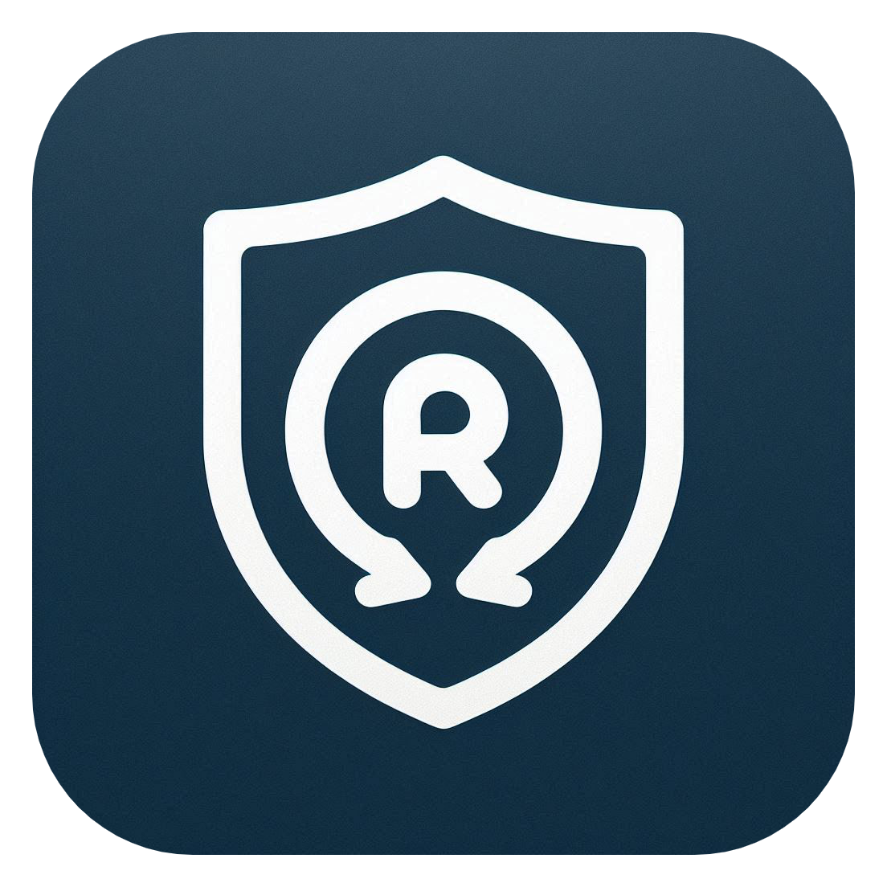

<h1> RecurSafe</h1>

RecurSafe is a secure mobile application built with Flutter, designed to help you manage and protect your sensitive documents and passwords locally on your device. It emphasizes privacy and security by storing data encrypted on your device.

## ✨ Features

- **Secure Document Storage:** Safely store and manage your important documents.
- **Password Management:** Keep your passwords organized and secure.
- **Local-First Data:** All your data is stored locally on your device, ensuring privacy.
- **Strong Encryption:** Utilizes Hive with AES encryption to protect your data at rest. Encryption keys are securely managed using `flutter_secure_storage`.
- **Onboarding Process:** A guided setup for new users to get started quickly.
- **User-Friendly Interface:** Built with Cupertino widgets for a clean, native iOS-style experience.
- **Notification Service:** Integrated for timely alerts and reminders (specific use cases depend on implementation).
- **Settings & Configuration:** Allows users to manage application preferences and includes an app reset functionality.
- **Provider State Management:** Efficiently manages application state for a responsive experience.

## 📱 UI Overview

The application uses a `CupertinoTabScaffold` for its main navigation, providing access to:

- Home
- Documents
- Passwords
- Settings

## 🚀 Getting Started

To get a local copy up and running, follow these simple steps.

### Prerequisites

- Flutter SDK: Make sure you have Flutter installed. If not, follow the Flutter installation guide.
- An IDE like Android Studio or VS Code with Flutter plugins.

### Installation

1.  **Clone the repo**:
    ```bash
    git clone https://github.com/ram3ez/recursafe.git
    ```
2.  **Navigate to the project directory**:
    ```bash
    cd recursafe
    ```
3.  **Install dependencies**:
    ```bash
    flutter pub get
    ```
4.  **Run the app**:
    ```bash
    flutter run
    ```

## 🛠️ Built With

- **Flutter**: UI toolkit for building natively compiled applications for mobile, web, and desktop from a single codebase.
- **Dart**: The programming language used by Flutter.
- **Hive**: A lightweight and blazing fast key-value database written in pure Dart. Used here with `HiveAesCipher` for encryption.
- **Provider**: A wrapper around InheritedWidget to make them easier to use and more reusable for state management.
- **flutter_secure_storage**: For securely storing the Hive encryption key.
- **DevicePreview**: For approximating how your app looks and feels on a wide variety of devices.
- **Cupertino Widgets**: For an iOS-style interface.

## 🤝 Contributing

Contributions are what make the open-source community such an amazing place to learn, inspire, and create. Any contributions you make are **greatly appreciated**.

If you have a suggestion that would make this better, please fork the repo and create a pull request. You can also simply open an issue with the tag "enhancement".
Don't forget to give the project a star! Thanks again!

1.  Fork the Project
2.  Create your Feature Branch (`git checkout -b feature/AmazingFeature`)
3.  Commit your Changes (`git commit -m 'Add some AmazingFeature'`)
4.  Push to the Branch (`git push origin feature/AmazingFeature`)
5.  Open a Pull Request

## 📄 License

This project is licensed under the MIT License - see the `LICENSE` file for details.
Copyright (c) 2025 Ram3ez.

Project Link: https://github.com/ram3ez/recursafe
